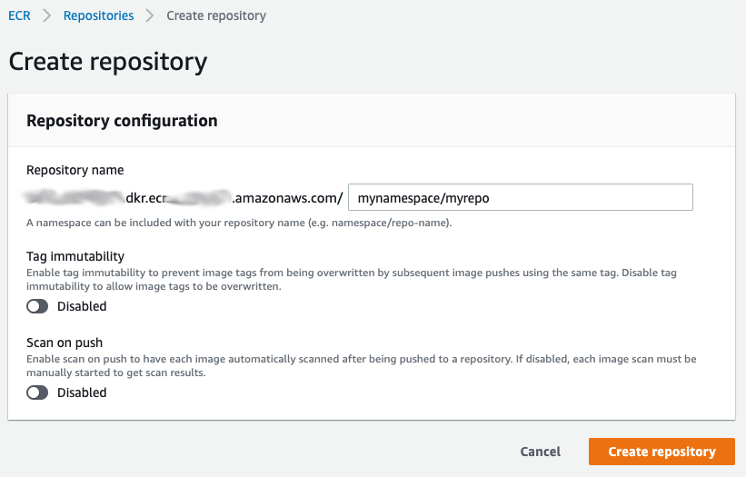
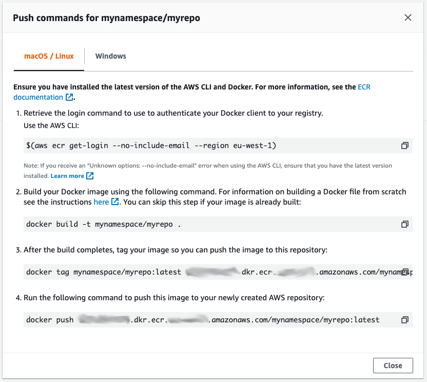
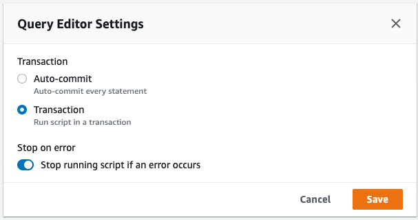

# Kill Bill/Kaui on AWS ECS Fargate/Aurora

I wanted Kill Bill to be running on a serverless Fargate docker container. Using some guidance and a lot of borrowed work from the core team, I was able to get this running. The database is based on serverless AWS Aurora.

## Create the ECR Repository
In the AWS Console, navigate to ECR and create a repository. For the purposes of this example, we'll assume you've named it *mynamespace/myrepo*.

## Building the Docker Image
The Dockerfile should handle the heavy lifting for you. Simply run the following commands to build and publish your image

~~~~
docker build -t mynamespace/myrepo .
~~~~

In order to prepare your image to be pushed to ECR, we need to tag it. The following command tags the image, but you will need to replace the URL with your own one that was created for you.

Go into the newly created ECR Repository in the AWS Console, and click View Push Commands. It will give you personalised commands to run, but they should look something like this:

~~~~
docker tag mynamespace/myrepo:latest <AWS ACCOUNT #>.dkr.ecr.<AWS REGION>.amazonaws.com/mynamespace/myrepo:latest

$(aws ecr get-login --no-include-email --region eu-west-1)

docker push <AWS ACCOUNT #>.dkr.ecr.<AWS REGION>.amazonaws.com/mynamespace/myrepo:latest
~~~~
At this point, the image should upload to ECR and you'll be able to create the Fargate Cluster

## Fargate Cluster
The scope of this example doesn't cover setting up the entire cluster, but below is an example Terraform config for the Kill Bill/Kaui task:

~~~~
resource  "aws_ecs_task_definition"  "billing"  {
  family  =  "${var.service_name}-billing"
  network_mode  =  "awsvpc"
  requires_compatibilities  = ["FARGATE"]
  cpu  =  "512"
  memory  =  "2048"
  task_role_arn  =  "${aws_iam_role.ecsBillingTaskRole.arn}"
  execution_role_arn  =  "${aws_iam_role.ecsBillingTaskExecutionRole.arn}"

  container_definitions  =  <<DEFINITION
[
  {
    "cpu": 512,
    "image": "${var.billing_image}",
    "memory": 2048,
    "name": "killbill",
    "networkMode": "awsvpc",
    "portMappings": [
      {
        "containerPort": 8080,
        "hostPort": 8080
      }
    ],
    "command": ["/bin/sh", "-c", "./killbill.sh"],
    "workingDirectory": "/var/lib/killbill",
    "environment": [
      {
        "name": "KILLBILL_DAO_URL",
        "value": "jdbc:mysql://${var.billing_db_endpoint}:3306/killbill"
      },
      {
        "name": "KILLBILL_DAO_USER",
        "value": "${var.billing_db_username}"
      },
      {
        "name": "KILLBILL_DAO_PASSWORD",
        "value": "${var.billing_db_password}"
      },
      {
        "name": "KAUI_CONFIG_DAO_URL",
        "value": "jdbc:mysql://${var.billingui_db_endpoint}:3306/kaui"
      },
      {
        "name": "KAUI_CONFIG_DAO_USER",
        "value": "${var.billingui_db_username}"
      },
      {
        "name": "KAUI_CONFIG_DAO_PASSWORD",
        "value": "${var.billingui_db_password}"
      },
      {
        "name": "KAUI_ROOT_USERNAME",
        "value": "${var.kaui_root_username}"
      },
      {
        "name": "KAUI_ROOT_PASSWORD",
        "value": "${var.kaui_root_password}"
      },
      {
        "name": "KILLBILL_SERVER_TEST_MODE",
        "value": "true"
      }
    ]
  }
]
DEFINITION
}
~~~~

Again, it's beyond the scope of this example to provide a turnkey solution. I will leave it to the reader to interpret the Terraform code above, and integrate it into their own solution.

## AWS Aurora Setup
I found the easiest way to do this was to download the relevant Docker Compose images from the Kill Bill documentation ([https://docs.killbill.io/latest/getting_started.html](https://docs.killbill.io/latest/getting_started.html))

I then connected to the database with MySQL Workbench and exported the database. After creating an Aurora cluster (with Terraform, of course), I ran the export using the AWS Console Query tool.

Couple of things to watch out for:

 1. You need to enable the Web Services Data API. From the RDS Console, select your Aurora Cluster, and click Modify. Tick the Data API checkbox, and apply the changes.
 2. The Query Editor will try and run one at a time. You can configure it to run the whole script as a transaction, and/or get it to stop on first error. Once in the editor, click on the cog (top right) to see the settings

